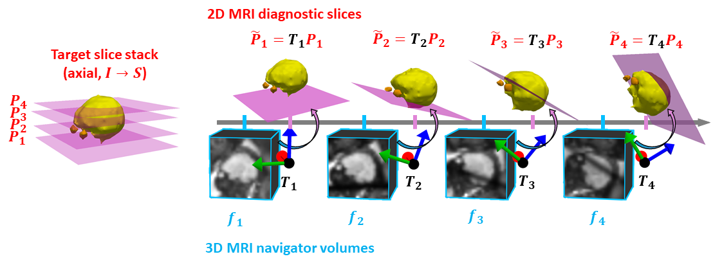
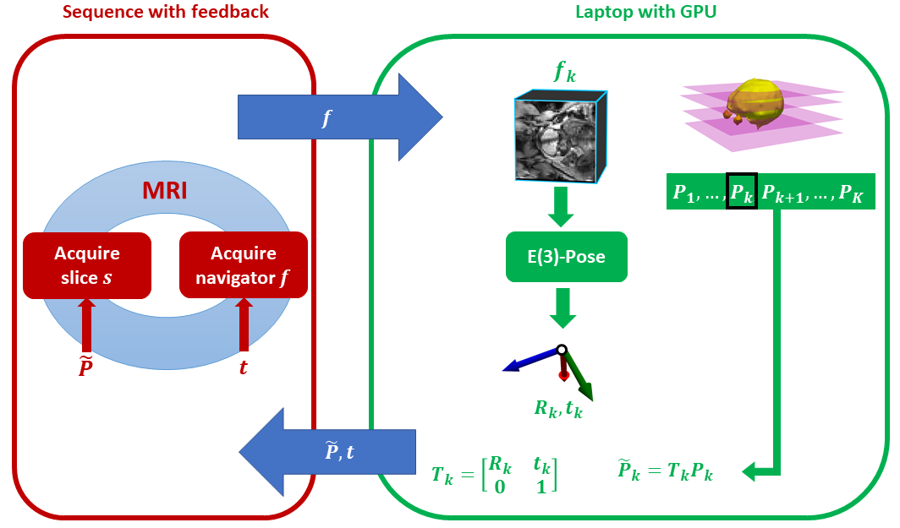

# Self-Driving MRI for Fetal Brain Imaging

In this repository, we present the first self-driving MRI system for fetal brain imaging.

 

 

To mitigate motion effects in fetal neuroimaging (T2-weighted 2D HASTE MRI slices), we adaptively rotate/translate imaging plane of each slice to account for the current fetal head pose, which is robustly estimated from fast, low-resolution 3D echo-planar imaging volumetric navigators (EPI-vNavs) interleaved between consecutive HASTE readouts1 using E(3)-Pose2. We also translate the field-of-view (FOV) of every EPI-vNav based on the current pose, such that the FOV is centered around the head.

 

 

We present a real-time feedback loop system for automated prescription of imaging slices that account for the fetal head motion in real time. Our implementation employs an interleaved sequence running on a 3T Siemens scanner, connected to a server hosted on a GPU-enabled laptop, using existing software3 to facilitate communication between the server and the scanner. We have evaluated our implementation on a phantom and have conducted preliminary evaluations *in utero*.

---
### Installation

Coming soon

 

### Usage

Coming soon

 

---
### Citation/Contact

If you find this work useful for your research, please cite:

**Towards real-time navigation in diagnostic fetal brain MRI** \
Muthukrishnan, Wighton, Frost, van der Kouwe, Lee, Adalsteinsson, Grant, Golland, Gagoski \
ISMRM (2026)

If you have any question regarding the usage of this code, or any suggestions to improve it, please raise an issue (preferred) or contact us at:\
**ramyamut@mit.edu**

 

---
### References
1*HASTE imaging with EPI volumetric navigators for real-time fetal head motion detection* \
Gagoski, McDaniel, van der Kouwe, Bhat, Wald, Adalsteinsson, Grant, Tisdall \
ISMRM Proceedings, 2016

2*Equivariant symmetry-aware head pose estimation for fetal MRI* \
Muthukrishnan, Gagoski, Lee, Grant, Adalsteinsson, Golland, Billot \
arXiV, 2025

3*MR software tools for real-time decision making and FOV prescription* \
Wighton, Hinds, Frost, Hoffmann, Gagoski, Varadarajan, Proulx, Reuter, Polimeni, Fischl, Ghosh, van der Kouwe \
ISMRM Proceedings, 2024

